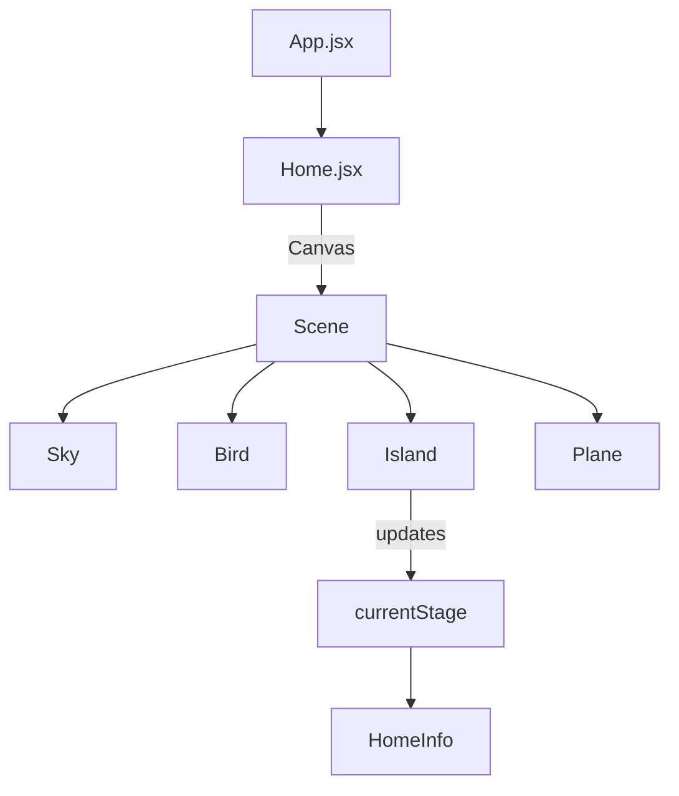

## 3D Portfolio – Project Overview

This document provides a concise overview of the app architecture, key components, and the current status of the project.

### Tech Stack
- **Build tool**: Vite 5 (`vite.config.js`)
- **Framework**: React 18 with React Router v6
- **3D**: Three.js via React Three Fiber (`@react-three/fiber`) and helpers from `@react-three/drei`
- **Animation**: React Spring for 3D (`@react-spring/three`), motion/Framer for UI micro-interactions
- **Styling**: Tailwind CSS 3 (`tailwind.config.js`, `src/index.css`)
- **i18n**: `i18next` + `react-i18next` (EN/DE)
- **Email**: `@emailjs/browser`
- **Analytics**: `@vercel/analytics`

### Scripts
```bash
npm run dev        # Start dev server
npm run build      # Production build
npm run preview    # Preview production build
npm run optimize-textures # Image/model optimizations (see scripts/)
```

### Deployment
- Vercel SPA rewrite is configured in `vercel.json` (all routes → `index.html`).
- Build targets modern browsers (`esnext`), sourcemaps enabled, GLB assets included.

---

## App Architecture

### Entry and Providers
- `src/main.jsx`
  - Wraps the app with `I18nextProvider` (translations) and Vercel `Analytics`.
- `src/App.jsx`
  - Wraps routes with `AudioProvider` (background music context).
  - Global layout (Navbar, AudioPlayer, page Routes).

### Routing
- `react-router-dom` single-page app with four routes:
  - `/` → `Home`
  - `/about` → `About`
  - `/projects` → `Projects`
  - `/contact` → `Contact`

### Internationalization
- `src/i18n.js`
  - Loads resources from `translations/en.json` and `translations/de.json`.
  - Persists language in `localStorage` under `language`.
- `src/components/LanguageSwitcher.jsx` toggles EN/DE and reflects active language.

### Styling
- Tailwind base + custom utility classes in `src/index.css` (e.g., `max-container`, `head-text`, `info-box`, `neo-btn`).
- Custom animations: gradient, fade-in, float, and neo-brutalism effects.

---

## 3D Scene Overview (Home)

- `src/pages/Home.jsx` hosts the interactive 3D scene rendered by `Canvas`.
- Preloads GLB assets for smooth experience; shows `LoadingScreen` while loading.
- Scene contents:
  - `Sky` (low-res → high-res swap-in)
  - `Bird` (ambient flight with animation)
  - `Island` (draggable/keyboard-rotatable; drives UI stage)
  - `Plane` (animation tied to rotation state)
- `HomeInfo` overlays contextual UI based on `currentStage` set by `Island` rotation.



### Key 3D Components
- `src/models/Island.jsx`
  - Props: `isRotating`, `setIsRotating`, `setCurrentStage`.
  - Pointer/touch/keyboard handlers rotate the island; momentum via damping.
  - Computes normalized Y-rotation and maps to `currentStage` (1–4) to drive UI prompts.
- `src/models/Sky.jsx`
  - Loads low-res `sky.glb` immediately; swaps material to high-res `sky-hq.glb` after a delay.
  - Rotates slowly when `isRotating` is true.
- `src/models/Bird.jsx`
  - Plays animation clip `Take 001` and moves along a simple path relative to the camera.
- `src/models/Plane.jsx`
  - Plays/stops animation `Take 001` depending on `isRotating`.
- `src/models/Fox.jsx` (Contact page)
  - Animations controlled by `currentAnimation` prop: `idle`, `walk`, `hit`.

### 3D Assets
- GLB files in `src/assets/3d/` with optimized textures alongside originals.
- Preloading used (`useGLTF.preload`) to improve perceived performance.

---

## UI Components
- `src/components/Navbar.jsx`
  - Logo link, responsive menu, route links, `LanguageSwitcher`.
- `src/components/HomeInfo.jsx`
  - Renders stage-based onboarding/CTA overlays for stages 1–4.
- `src/components/CTA.jsx`
  - Reusable call-to-action section linking to Contact.
- `src/components/Alert.jsx`
  - Inline status alert (success/error) for contact form feedback.
- `src/components/Loader.jsx`
  - In-canvas progress indicator using drei `useProgress`.
- `src/components/LoadingScreen.jsx`
  - Full-screen loading screen with progress counter for initial asset load.
- `src/components/AudioPlayer.jsx`
  - Floating music toggle (shows track info when playing) powered by `AudioContext`.

### Context
- `src/context/AudioContext.jsx`
  - Lazy-loads background audio on first interaction; provides `isPlayingMusic`, `toggleMusic`, and info visibility state.

---

## Pages
- `src/pages/Home.jsx`
  - Main 3D experience and stage-driven onboarding via `HomeInfo`.
- `src/pages/About.jsx`
  - Skills grid and experience timeline from `src/constants/index.js` with EN/DE fields.
- `src/pages/Projects.jsx`
  - Cards sourced from `constants.projects`; supports localized names/status/descriptions; links to live and GitHub.
- `src/pages/Contact.jsx`
  - Contact form using EmailJS; animated `Fox` model reacts to focus/submit.
  - CV download modal with language choice (PDFs in `public/`).

---

## Data & Assets
- `src/constants/index.js`
  - `skills`, `experiences`, `socialLinks`, `projects` with bilingual text where applicable.
- `src/assets/`
  - `3d/` GLB models and optimized textures
  - `icons/`, `images/`, audio (`dream.ogg`)
  - `scripts/` contains Node scripts for optimizing models/textures

---

## Environment Variables (EmailJS)
Create a `.env.local` with the following keys for the contact form:
```bash
VITE_APP_EMAILJS_SERVICE_ID=...
VITE_APP_EMAILJS_TEMPLATE_ID=...
VITE_APP_EMAILJS_PUBLIC_KEY=...
```

---

## SEO & Meta
- `robots.txt` allows crawling (with a specific `Disallow` for `/nogooglebot/`).
- Favicon and meta images in `src/assets` and `public/`.

---

## Current Status and Notes
- The 3D scene is central and fully interactive; models are preloaded for smoother UX.
- Internationalization is complete for DE/EN across constants and UI strings.
- Projects page includes live links; one project shows a localized "Under Development" status.
- Background music is opt-in (loaded on first interaction) and user-controllable.

### Potential Enhancements
- Add unit tests and basic e2e smoke tests for routes and forms.
- Consider persisting `isPlayingMusic` state across sessions.
- Verify animation dependency alignment (Framer/Motion) across `package.json` and imports.
- Add 404 route fallback.

---

## Quick Start
```bash
pnpm i   # or npm i / yarn
pnpm dev # start dev server at http://localhost:5173
```

If deploying to Vercel, the provided `vercel.json` SPA rewrite is sufficient.

